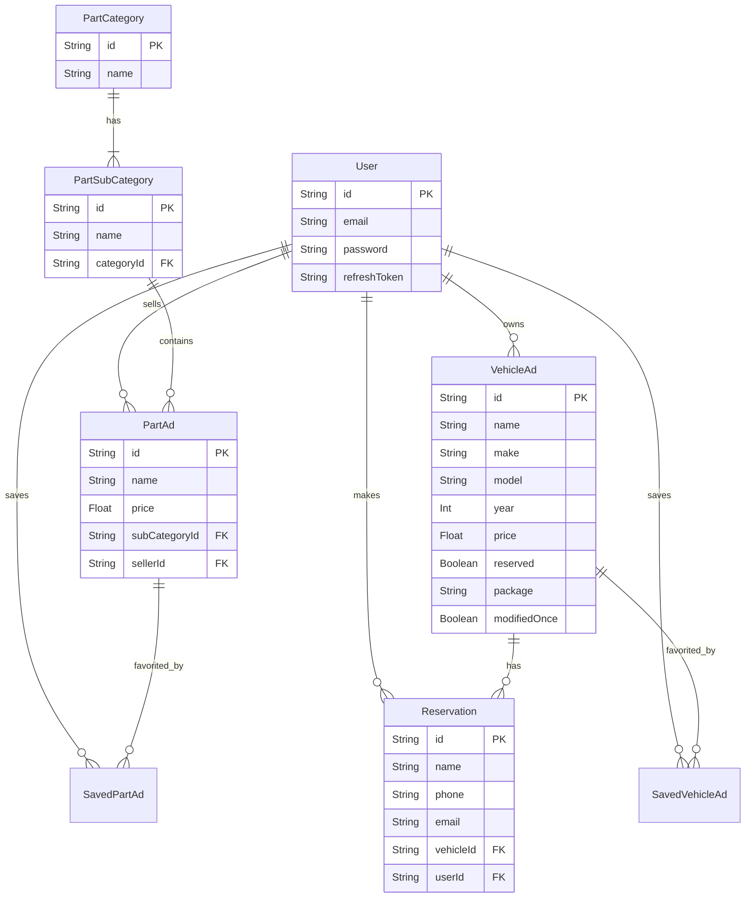

# AutoShqip 🚗🔧

AutoShqip is a modern, full-stack vehicle-buying and spare parts e-commerce marketplace. The platform provides localized support for English and Albanian languages and enables users to browse, search, and list vehicles or automotive spare parts, manage user accounts, save favorite listings, and make reservations.

---

## 🛠️ Technology Stack

AutoShqip is built using a decoupled Client-Server architecture utilizing a modern JavaScript-centric stack:

### Frontend
- **React 19** – Component-based User Interface library.
- **React Router DOM v7** – Dynamic client-side routing.
- **Axios** – HTTP client for communication with the backend REST API.
- **i18next & react-i18next** – Localization and translation support (English `en` & Albanian `al`).
- **Vanilla CSS** – Highly tailored, custom layouts and responsive styling (in `compstyle` and `pagestyle` folders).
- **React Icons** – Premium SVG icons for streamlined navigation and visual cues.

### Backend
- **Node.js** – Runtime environment.
- **Express.js (v5)** – Web framework for creating robust API endpoints.
- **Prisma ORM** – Type-safe database connection and schema management.
- **SQLite** – Relational SQL database for local development and database management (`dev.db`).
- **JSON Web Tokens (JWT)** – Stateless authentication using double token patterns (Access Token + Refresh Token).
- **Bcrypt.js** – Secure password hashing and encryption.
- **Multer** – Middleware for handling file uploads (images for vehicle and spare parts advertisements).

---

## 🏛️ Components & Architecture

The codebase is structured into two main independent directories: `backend` and `diploma` (the frontend application).

### Directory Structure Overview
```
vehicle-buying-ecommerce/
├── diploma/                  # React Frontend Application
│   ├── public/               # Static assets & localization files
│   │   └── locales/          # Translation JSON files (en, al)
│   ├── src/
│   │   ├── assets/           # Images and SVG icons
│   │   ├── components/       # Reusable layout and interactive components
│   │   ├── compstyle/        # Custom stylesheets for components
│   │   ├── pages/            # View pages mapped to React Router paths
│   │   ├── pagestyle/        # Custom stylesheets for pages
│   │   ├── App.js            # Main React component & routes definition
│   │   ├── api.js            # Axios client configuration with JWT middleware interceptors
│   │   └── i18n.js           # Internationalization setup
│   └── package.json          # Frontend dependencies and scripts
│
├── backend/                  # Express API Server
│   ├── middleware/           # Middleware for auth validation (JWT tokens)
│   ├── prisma/               # Database schema definition, migration files, and seeds
│   │   ├── schema.prisma     # Prisma DB configuration and models
│   │   ├── seed.js           # Vehicle and user data database seeder
│   │   └── populate_parts.js # Spare parts categories and listings data seeder
│   ├── routes/               # API route controllers
│   │   ├── auth.js           # Register, login, token refresh, and logout
│   │   ├── vehicles.js       # CRUD operations & reservation handling for vehicle ads
│   │   ├── parts.js          # CRUD operations & filters for spare parts listings
│   │   ├── reviews.js        # Create, read, and edit customer reviews
│   │   ├── savedItems.js     # Saved/bookmarked listings management
│   │   └── upload.js         # Single-file image uploads
│   ├── uploads/              # Local storage folder for uploaded listing images
│   ├── index.js              # Express entrypoint
│   └── package.json          # Backend dependencies and scripts
```

### Main Client Pages (`diploma/src/pages/`)
1. **Home (`Home.js`)**: Landing page showcasing featured listings, newest vehicle listings, interactive category navigation, and client reviews.
2. **Vehicle Ads (`VehicleAds.js`)**: Listing catalog for all vehicles. Includes multi-dimensional filters (make, model, price, year, mileage, transmission, engine, color) and an interactive calculator for base insurance and monthly installments (buying on credit).
3. **Spare Parts (`Spare.js`)**: Catalog interface for searching and posting auto spare parts sorted by main categories and subcategories.
4. **Saved Items (`SavedItems.js`)**: User dashboard folder showing favorited vehicle ads and spare parts for quick access.
5. **My Account (`MyAcc.js`)**: Dedicated control center for logged-in users to manage their active listings (edit, delete, create new ads) and review reservations placed on their vehicles.

### Component Design Details (`diploma/src/components/`)
- `Header.js` / `TopHeader.js` / `Footer.js`: Uniform layout elements containing language selectors, navigation menus, and login/register modal toggles.
- `VehicleForm.js` / `SparePartForm.js`: Dynamic forms handling client-side validation, uploading images, and calling backend services to create or edit advertisements.
- `VehicleAdCard.js` / `NewVehicles.js`: Content cards summarizing vehicle properties (price, year, mileage, category) for listings.

---

## 🌟 Key Functionality

1. **Authentication Flow (Access vs. Refresh Tokens)**:
   - Users register with a unique email and password (encrypted with `bcryptjs`).
   - Logging in returns a short-lived `accessToken` (1 hour) and a long-lived `refreshToken` (7 days) stored securely.
   - Axios request interceptors automatically refresh expired access tokens in the background to ensure a seamless user experience.

2. **Advanced Search & Filtering**:
   - Dynamic API queries dynamically filter results directly at the database level (`PrismaClient`).
   - Supports range-based queries (e.g., `priceFrom` / `priceTo`, `yearFrom` / `yearTo`) and exact match filters.

3. **Booking & Reservation Engine**:
   - Users can reserve available vehicles. The system updates the vehicle's status to `reserved = true` and generates a `Reservation` database record linking the user, listing, and personal contact info.
   - Listing owners can track who reserved their vehicle via the `My Account` portal.

4. **Tiered Advertising Model ("Premium" Ads)**:
   - Supports packages (e.g., standard vs. premium) with business rules.
   - Premium advertisements enforce a policy where they can only be modified once (`modifiedOnce: true`).

5. **Spare Parts Classification**:
   - Parts are linked hierarchically (`PartCategory` -> `PartSubCategory` -> `PartAd`).
   - Deep attributes like installation difficulty, detailed engine compatibility, and model year are tracked.

6. **Internationalization (i18n)**:
   - Support for dual-languages (`English` and `Albanian`).
   - Translation keys dynamic translation of layouts, forms, error messages, and currency listings.

---

## 📁 Database Schema Map
Below is a simplified view of the Prisma relational models used:


